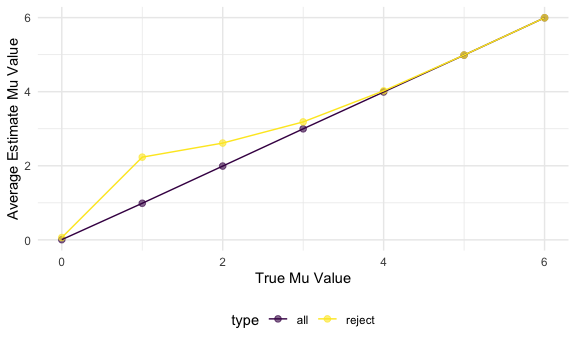

P8105 Homework 5
================
Shehzrin Shah
2024-11-07

## Problem 1

Create a function for size n that randomly draws birthdays for each
person, checks whether there are duplicate birthdays in the group, and
returns `TRUE` or `FALSE` based on the result.

``` r
bday_sim = function(n) {
  bdays = sample(1:365, size = n, replace = TRUE)
  duplicate = length(unique(bdays)) < n 
  return(duplicate)
}
```

Run this function 10,000 times for each group size between 2 and 50.

``` r
sim_res =
  expand_grid(n = 2:50,
              iter = 1:10000) |>
  mutate(res = map_lgl(n, bday_sim)) |>
  group_by(n) |>
  summarize(prob = mean(res))
```

Make a plot showing the probability that at least two people in the
group will share a birthday (by averaging across 10,000 simulation runs
for each group size between 2 and 50) as a function of group size.

``` r
sim_res |>
  ggplot(aes(x = n, y = prob)) +
  geom_line() +
  labs(title = "Probability of Shared Birthday in a Group",
       x = "Group Size",
       y = "Probability of Shared Birthday")
```


As n (# of people in a room) increases, the probability of a shared
birthday increases. When the group size is about 22 people, the
probability of a shared birthday is about 50%. With a group size of 50,
the probability is nearly 100% which suggests it is almost certain or
extremely likely that at least two people in the group will share a
birthday. I expect that increasing the group size even more would, at
some point, result in a 100% probability of a shared birthday.

## Problem 2

Set design elements/create function.

``` r
sim_power = function(mu, n = 30, sd = 5) {
  sim_data = t.test(rnorm(n, mu, sd)) |>
    broom::tidy() |>
    select(estimate, p.value)
  return(sim_data)
}
```

Generate 5000 datasets from the model, and repeat the above for mu = {1,
2, 3, 4, 5, 6}.

``` r
sim_results = expand_grid(
  mu = c(0:6),
  iter = c(1:5000)
) |>
  mutate(res = map(mu, sim_power))
```

Make a plot showing the proportion of times the null was rejected (power
of the test) and the true value of mu.

``` r
sim_results |>
  unnest(res) |>
  mutate(reject = p.value < 0.05) |>
  select(mu, reject) |>
  group_by(mu) |>
  summarize(prob_reject = mean(reject)) |>
  ggplot(aes(x = mu, y = prob_reject)) +
  geom_point() + 
  labs(x = "True Mu",
       y = "Power (Proportion of Null Rejections)")
```


This plot shows a clear/strong association between effect size and power
(positive and nonlinear association). As true mean increases, power
increases until a power of 1.00 is reached (power approaches 1 as the
true mean increases). The probability of rejection crosses 0.50 at a
true mean of approximately 2.

Make a plot showing the average estimate mu hat and the true value of
mu. Make another plot of the average estimate of mu hat only in samples
for which the null was rejected and the true value of mu.

``` r
all_sim_plot = sim_results |>
  unnest(res) |>
  mutate(reject = p.value < 0.05) |>
  group_by(mu) |>
  summarize(mean = mean(estimate)) |>
  mutate(type = "all")

sim_res_reject = sim_results |>
  unnest(res) |>
  mutate(reject = p.value < 0.05) |>
  group_by(mu, reject) |>
  summarize(mean = mean(estimate)) |>
  filter(reject == TRUE) |>
  mutate(type = "reject") |>
  select(mu, mean, type)
```

    ## `summarise()` has grouped output by 'mu'. You can override using the `.groups`
    ## argument.

``` r
sim_res_total = rbind(all_sim_plot, sim_res_reject)

sim_res_total |>
  ggplot(aes(x = mu, y = mean, col = type)) + 
  geom_point(size = 2, alpha = 0.6) + 
  geom_line() +
  labs(
    x = "True Mu Value",
    y = "Average Estimate Mu Value"
  )
```



The sample average estimated mu (muhat) across tests for which the null
is rejected is approximately equal to the true mu value when the true mu
value is 4 and greater. At true mu values of 3 and less than 3, the
average estimated values are slightly higher for the most part.
Rejecting the null hypothesis requires a sample mean sufficiently far
from 0 (which biases the average estimated mu upwards when the null is
rejected). This means the rejected samples are not representative of all
possible samples. As mu increases, bias lessens, and the average
estimated mu values align more closely with the true mean.

## Problem 3

Import raw data obtained by the Washington Post on homicides in 50 large
U.S. cities.

``` r
homicide_df = 
  read_csv("homicide-data.csv", na = c("NA",".",""))
```

    ## Rows: 52179 Columns: 12
    ## ── Column specification ────────────────────────────────────────────────────────
    ## Delimiter: ","
    ## chr (9): uid, victim_last, victim_first, victim_race, victim_age, victim_sex...
    ## dbl (3): reported_date, lat, lon
    ## 
    ## ℹ Use `spec()` to retrieve the full column specification for this data.
    ## ℹ Specify the column types or set `show_col_types = FALSE` to quiet this message.

The Washington Post has gathered data on homicides across 50 large U.S.
cities over the past years, providing information on more than 52179
observations of homicide cases. This dataset contains 12 variables,
which are `uid`, `reported_date`, `victim_last`, `victim_race`,
`victim_age`, `victim_sex`, `city`, `state`, `lat`, `lon`, and
`disposition`. Each entry is information about a unique homicide
incident, the victim’s demographics, and the case resolution status.

Create a `citystate_df` variable. Summarize within cities to obtain the
total number of homicides and the number of unsolved homicides.

``` r
citystate_df = homicide_df |>
  janitor::clean_names() |>
  mutate(
    city_state = str_c(city, ", ", state), 
    unsolved = disposition %in% c("Closed without arrest", "Open/No arrest")
    ) |>
  group_by(city_state) |>
  summarize(
    total_homicides = n(),
    unsolved_homicides = sum(unsolved, na.rm = TRUE)
  ) 
```

Estimate the proportion of homicides that are unsolved in Baltimore, MD.

``` r
baltimore_df = citystate_df |>
  filter(city_state == "Baltimore, MD") |>
  select (-city_state) |>
  as.matrix()|>
  prop.test() 

baltimore_tidy_result = broom::tidy(baltimore_df) |>
  select(estimate, conf.low, conf.high) |>
  knitr::kable()

baltimore_tidy_result
```

|  estimate |  conf.low | conf.high |
|----------:|----------:|----------:|
| 0.6076956 | 0.5934734 | 0.6217388 |

Extract both the proportion of unsolved homicides and the confidence
interval for each of the cities.

``` r
cities_df = citystate_df |>
  mutate(
    prop_test = map2(unsolved_homicides, total_homicides, ~ prop.test(x = .x, n = .y)),
    tidy_result = map(prop_test, broom::tidy) 
  ) |>
  unnest(tidy_result) |>
  select(city_state, estimate, conf.low, conf.high) 
```

Create a plot that shows the estimates and CIs for each city.

``` r
cities_df = cities_df |> 
  arrange(desc(estimate)) |> 
  mutate(city_state = fct_reorder(city_state, estimate))

ggplot(cities_df, aes(x = city_state, y = estimate)) +
  geom_point() +
  geom_errorbar(aes(ymin = conf.low, ymax = conf.high), width = 0.2) +
  labs(
    title = "Proportion of Unsolved Homicides by City",
    x = "City",
    y = "Proportion of Unsolved Homicides",
    caption = "Confidence intervals are based on a 95% confidence level"
  ) +
  theme(axis.text.x = element_text(angle = 45, hjust = 1, size = 5))
```


